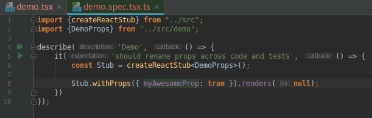

> Create type safe mock React components to use in tests

[](https://travis-ci.com/NiGhTTraX/react-mock-component)
[](https://codecov.io/gh/NiGhTTraX/react-mock-component) 

Check out the [chai plugin](https://github.com/NiGhTTraX/chai-react-mock) and the [jest helper](https://github.com/NiGhTTraX/jest-react-mock) as well.

---

## Installation

With npm

```sh
npm i -D jest-react-mock
```

or with yarn

```sh
yarn add -D jest-react-mock
```


## Usage

```typescript jsx
import React from 'react';
import createReactMock from 'react-mock-component';
import { render } from 'react-dom';

const Foo = createReactMock<{ bar: number }>();
Foo.withProps({ bar: 42 }).renders(<span>fake content</span>);

render(<Foo bar={42} />);

console.log(Foo.renderedWith({ bar: 42 })); // true
console.log(document.body.innerHTML); // <span>fake content</span>
```

You can of course use this library without TypeScript, you just won't
get any errors if you for instance check for the wrong prop.


## Type safety

All the methods are fully typed to prevent mistakes where the tests don't match the code they're testing. Moreover, an IDE with good support for TypeScript e.g. WebStorm can provide autocomplete and automatic refactoring of props across code and tests.




## API

### `createReactMock<Props>()`

Returns a real component that records the props it receives and allows you to set [expectations](#withpropsprops-partialprops) before hand or [check them afterwards](#renderedwithprops-partialprops).

```typescript jsx
import createReactMock from 'react-mock-component';
import React from 'react';
import { render } from 'react-dom';

const Mock = createReactMock<{ foo: string }>();
render(<Mock foo="bar" />);
render(<Mock foo={23} />); // type error
```

### `withProps(props: DeepPartial<Props>)`

Sets an expectation that the component will receive the given props. Chain it with [`renders`](#rendersjsx-jsx) to finish the expectation.

```typescript jsx
import createReactMock from 'react-mock-component';

const Mock = createReactMock<{ foo: string }>();
Mock.withProps({ foo: 'bar' })
Mock.withProps({ foo: 23 }) // type error
Mock.withProps({ }) // expects any props
```

An expectation can only be consumed once. Once the component receives matching props the corresponding expectation will be unset.

If the component receives props that don't match any expectation (either because one wasn't set or because all have been consumed) then it will render `null`.

### `renders(jsx: JSX)`

Finishes the previously set expectation and sets what the component will render when given the expected props.

```typescript jsx
import createReactMock from 'react-mock-component';
import React from 'react';
import { render } from 'react-dom';

const Mock = createReactMock<{ foo: string }>();
Mock.withProps({ foo: 'bar' }).renders(<span>foobar</span>);

render(<Mock foo="something else" />); // will render null
render(<Mock foo="bar" />); // will render "foobar"
render(<Mock foo="bar" />); // will render null
```

### `renderedWith(props: DeepPartial<Props>): boolean`

Check if the component was rendered with the given props.

```typescript jsx
import createReactMock from 'react-mock-component';
import React from 'react';
import { render } from 'react-dom';

const Mock = createReactMock<{ foo: string }>();
Mock.withProps({ foo: 'bar' }).renders(<span>foobar</span>);

render(<Mock foo="bar" />); // will render "foobar"
render(<Mock foo="baz" />); // will render null

Mock.renderedWith({ foo: "bar" }) // true
Mock.renderedWith({ foo: "baz" }) // true
Mock.renderedWith({ foo: "unexpected" }) // false
Mock.renderedWith({ foo: 23 }) // type error
```

### `rendered: boolean`

Returns if the component was rendered at least once. The mock doesn't have to have any expectation for this to become `true`.

```typescript jsx
import createReactMock from 'react-mock-component';
import React from 'react';
import { render } from 'react-dom';

const Mock1 = createReactMock<{ foo: string }>();
const Mock2 = createReactMock<{ foo: string }>();

render(<Mock1 foo="bar" />); // will render null
Mock1.rendered // true


Mock2.withProps({ foo: 'baz' }).renders(<span>foobar</span>);
render(<Mock2 foo="baz" />); // will render "foobar"
Mock2.rendered // true
```

### `mounted: boolean`

Returns if the component is currently mounted.

```typescript jsx
import createReactMock from 'react-mock-component';
import React from 'react';
import { render, unmount } from 'react-dom';

const Mock = createReactMock();

console.log(Mock.mounted); // false
render(<Mock />); 
console.log(Mock.mounted); // true
unmount();
console.log(Mock.mounted); // false
```

### `renderCalls: Props[]`

Get all the props for all the renders of the mock.

```typescript jsx
import createReactMock from 'react-mock-component';
import React from 'react';
import { render } from 'react-dom';

const Mock = createReactMock<{ foo: string }>();

render(<Mock foo="bar" />); // will render null
render(<Mock foo="baz" />); // will render null

Mock.renderedCalls[0] // { foo: 'bar' }
Mock.renderedCalls[1] // { foo: 'baz' }
```

### `lastProps: Props`

Get the props for the last render.

```typescript jsx
import createReactMock from 'react-mock-component';
import React from 'react';
import { render } from 'react-dom';

const Mock = createReactMock<{ foo: string }>();

render(<Mock foo="bar" />); // will render null
render(<Mock foo="baz" />); // will render null

Mock.lastProps // { foo: 'baz' }
```
